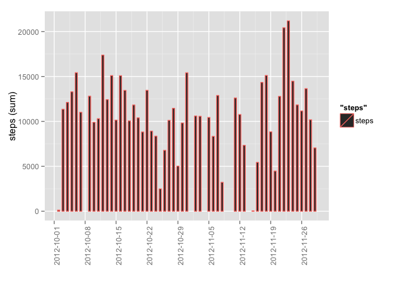
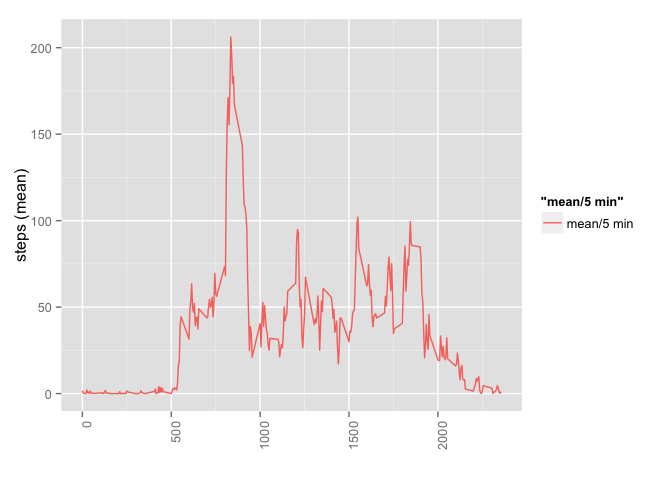
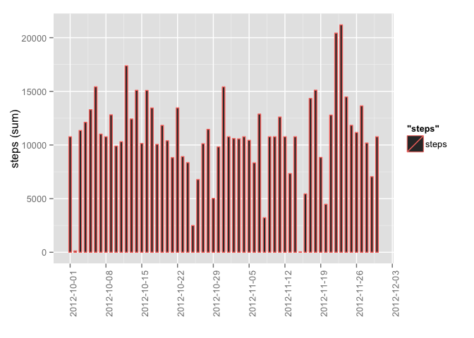
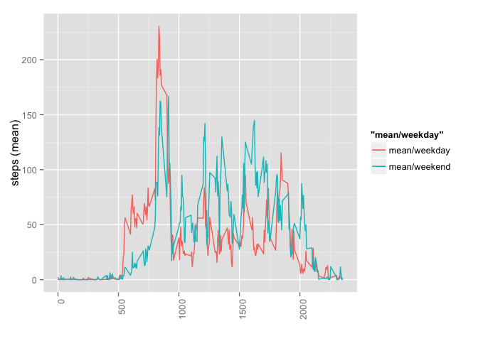

# Reproducible Research: Peer Assessment 1


## Loading and preprocessing the data

```r
library(ggplot2)
library(scales)
library(dplyr)
```

```
## 
## Attaching package: 'dplyr'
```

```
## The following objects are masked from 'package:stats':
## 
##     filter, lag
```

```
## The following objects are masked from 'package:base':
## 
##     intersect, setdiff, setequal, union
```

```r
activity <- read.csv(file = "data/activity.csv")
head(activity)
```

```
##   steps       date interval
## 1    NA 2012-10-01        0
## 2    NA 2012-10-01        5
## 3    NA 2012-10-01       10
## 4    NA 2012-10-01       15
## 5    NA 2012-10-01       20
## 6    NA 2012-10-01       25
```


## What is mean total number of steps taken per day?

```r
# preprocess
activity_by_day <- activity[!is.na(activity$steps),]
activity_by_day$date <- as.Date(activity_by_day$date)

# plot sum of steps by date as histogram
plot <- ggplot(data = activity_by_day, aes(x = date, y = steps, width = 0.5, color = "steps"))
plot <- plot + stat_summary(fun.y = sum, geom = "bar")
plot <- plot + scale_x_date(labels = date_format("%Y-%m-%d"), breaks = "1 week")
plot <- plot + theme(axis.text.x = element_text(angle = 90, hjust = 1))
plot <- plot + xlab("") + ylab("steps (sum)")
plot
```

<!-- -->

```r
# print mean and median for overall steps
activity_steps_by_day <- activity_by_day %>% group_by(date) %>% summarize(sum = sum(steps))
mean_steps_per_day <- mean(activity_steps_by_day$sum)
median_steps_per_day <- median(activity_steps_by_day$sum)

print("Median and Mean stats for overall dataset")
```

```
## [1] "Median and Mean stats for overall dataset"
```

```r
print(c("Mean", mean_steps_per_day))
```

```
## [1] "Mean"             "10766.1886792453"
```

```r
print(c("Median", median_steps_per_day))
```

```
## [1] "Median" "10765"
```


## What is the average daily activity pattern?


```r
# preprocess
activity_by_interval <- activity[!is.na(activity$steps),]
activity_by_interval$date <- as.Date(activity_by_day$date)
activity_by_interval <- activity_by_interval %>% group_by(interval)

# plot the average number of steps for each interval
plot <- ggplot(data = activity_by_interval, aes(x = interval, y = steps, width = 0.5))
plot <- plot + stat_summary(fun.y = mean, geom = "line", aes(color = "mean/5 min"))
plot <- plot + theme(axis.text.x = element_text(angle = 90, hjust = 1))
plot <- plot + xlab("") + ylab("steps (mean)")
plot
```

<!-- -->

```r
# find and filter by the highest average of steps
activity_steps_max_by_interval <- activity_by_interval %>% group_by(interval) %>% summarize(max = max(mean(steps)))
highest <- activity_steps_max_by_interval[which.max(activity_steps_max_by_interval$max), c(1, 2)]
print("The 5-minute interval that, on average, contains the maximum number of steps")
```

```
## [1] "The 5-minute interval that, on average, contains the maximum number of steps"
```

```r
print(highest)
```

```
## Source: local data frame [1 x 2]
## 
##   interval      max
##      (int)    (dbl)
## 1      835 206.1698
```

## Imputing missing values


```r
# report the number of rows with NA from the original dataset
activity_incomplete <- is.na(activity$steps)
sum_activity_incomplete <- sum(activity_incomplete)
print(c("Number of records without a value: ", sum_activity_incomplete))
```

```
## [1] "Number of records without a value: "
## [2] "2304"
```

```r
# create a new dataset where NA are replaced with the average of the overall 5 min intervals
# for this create a dataframe which maps interval to the corresponding mean (inteval x mean)
activity_by_interval_and_mean = activity_by_interval %>% group_by(interval) %>% summarize(mean = mean(steps))

# replace all NAs with the corresponding mean using previously computed results
# (there is a "nicer" way doing a vectorized computing but somehow this was even more unreadable as the for loop)
activity_imputed <- activity
activity_imputed$date <- as.Date(activity_imputed$date)
for (i in 1:nrow(activity_imputed)) {
  if (is.na(activity_imputed[i, ]$steps)) {
    activity_imputed[i, ]$steps <- activity_by_interval_and_mean[activity_by_interval_and_mean$interval == activity_imputed[i, ]$interval, ]$mean
  }
}

# plot sum of steps by date as histogram
plot <- ggplot(data = activity_imputed, aes(x = date, y = steps, width = 0.5, color = "steps"))
plot <- plot + stat_summary(fun.y = sum, geom = "bar")
plot <- plot + scale_x_date(labels = date_format("%Y-%m-%d"), breaks = "1 week")
plot <- plot + theme(axis.text.x = element_text(angle = 90, hjust = 1))
plot <- plot + xlab("") + ylab("steps (sum)")
plot
```

<!-- -->

```r
# print mean and median for overall steps
activity_imputed_by_day <- activity_imputed %>% group_by(date) %>% summarize(sum = sum(steps))
mean_steps_per_day_imputed <- mean(activity_imputed_by_day$sum)
median_steps_per_day_imputed <- median(activity_imputed_by_day$sum)

print("Median and Mean stats for overall dataset (imputed")
```

```
## [1] "Median and Mean stats for overall dataset (imputed"
```

```r
print(c("Mean", mean_steps_per_day_imputed))
```

```
## [1] "Mean"             "10766.1886792453"
```

```r
print(c("Median", median_steps_per_day_imputed))
```

```
## [1] "Median"           "10766.1886792453"
```

```r
print("In contrast to unimposed data there are values available for all days now. Means and Medians are not really affected. That might be due to the overall low amout of missing data (2304 of 17,568)")
```

```
## [1] "In contrast to unimposed data there are values available for all days now. Means and Medians are not really affected. That might be due to the overall low amout of missing data (2304 of 17,568)"
```

## Are there differences in activity patterns between weekdays and weekends?


```r
# create a factor variable for whether the date is a weekday or weekend
activity_imputed_with_weekend_factor <- activity_imputed %>% mutate(weekday = weekdays(date)) %>% mutate(is_weekend = as.factor(ifelse (weekday %in% c("Saturday", "Sunday"), "Weekend", "Weekday"))) %>% select(-weekday)

# plot the average number of steps for each interval and weekday/weekend
activity_imputed_by_weekday <- activity_imputed_with_weekend_factor[which(activity_imputed_with_weekend_factor$is_weekend == "Weekday"), ]
activity_imputed_by_weekend <- activity_imputed_with_weekend_factor[which(activity_imputed_with_weekend_factor$is_weekend == "Weekend"), ]

# for better comparing the data I have choosen to draw them in one panel
plot <- ggplot(data = activity_imputed_with_weekend_factor, aes(x = interval, y = steps, width = 0.5))
plot <- plot + stat_summary(data = activity_imputed_by_weekday, fun.y = mean, geom = "line", aes(color = "mean/weekday"))
plot <- plot + stat_summary(data = activity_imputed_by_weekend, fun.y = mean, geom = "line", aes(color = "mean/weekend"))
plot <- plot + theme(axis.text.x = element_text(angle = 90, hjust = 1))
plot <- plot + xlab("") + ylab("steps (mean)")
plot
```

<!-- -->
